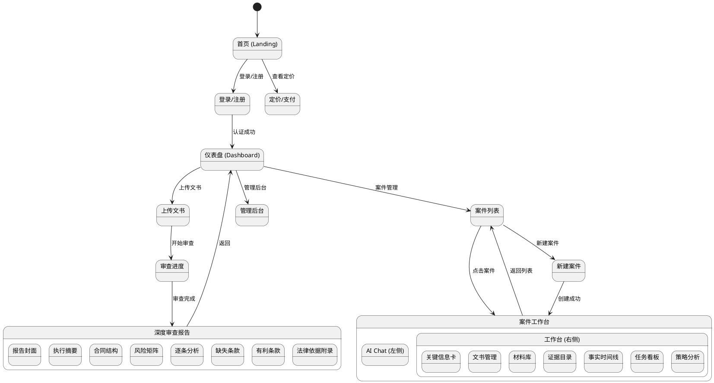
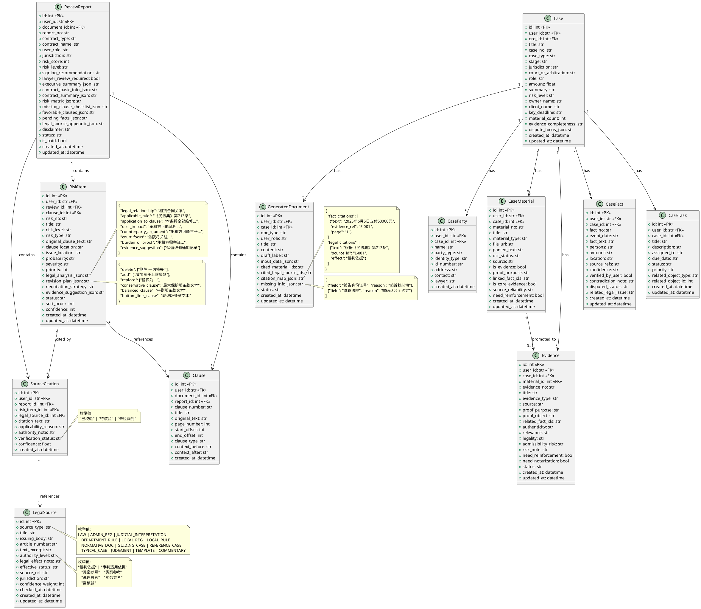
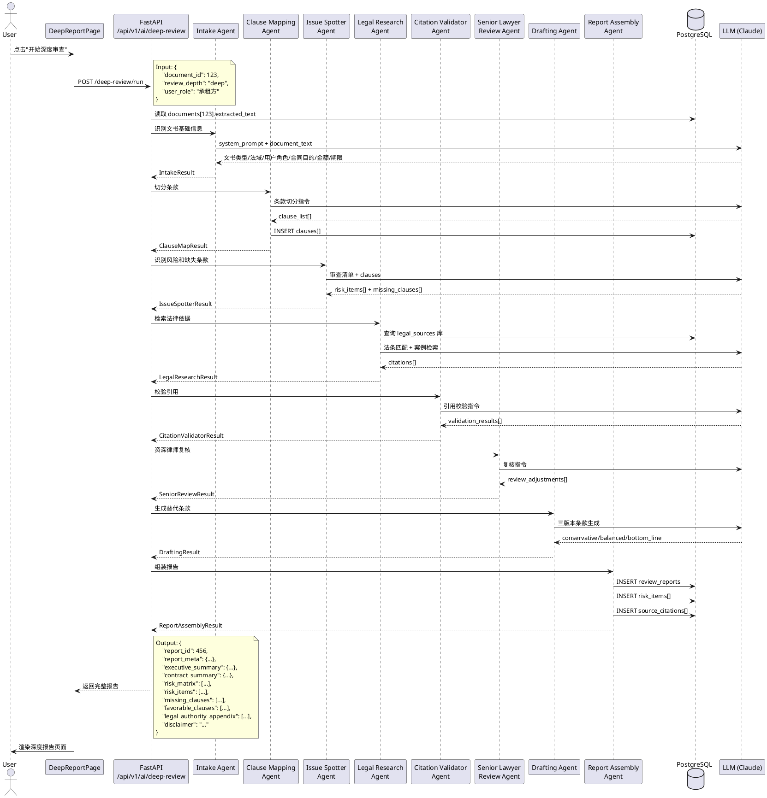
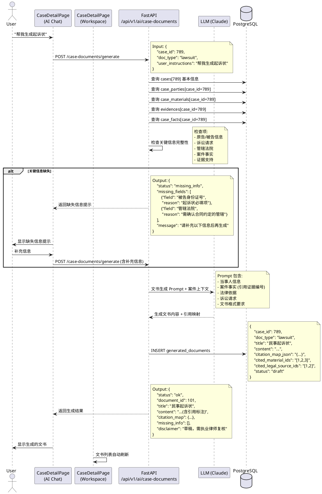
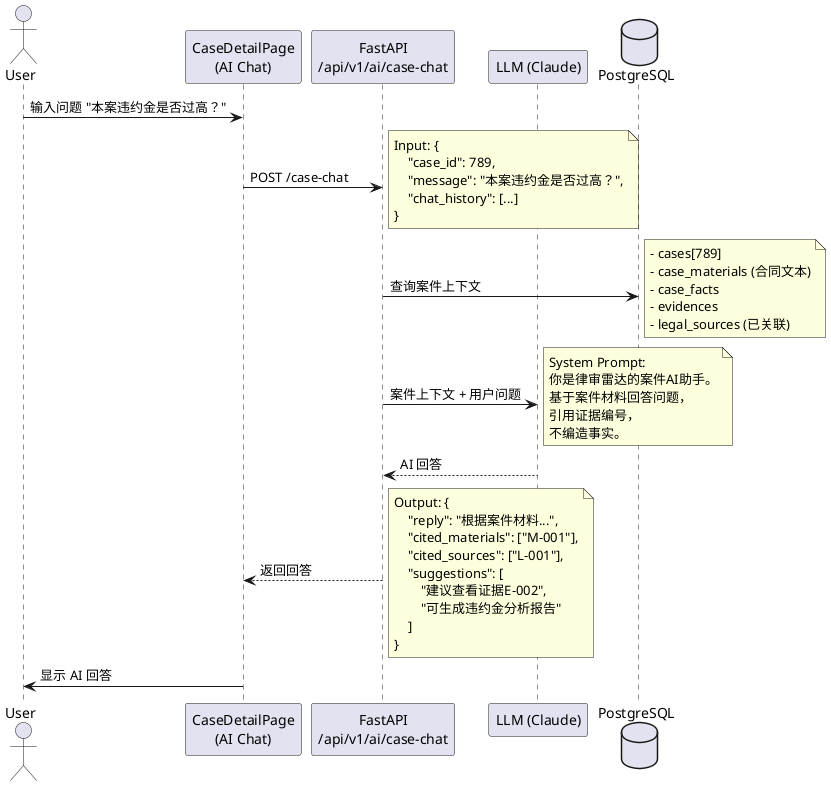

# 律审雷达 系统设计文档 v2.0

> 深度法律审查报告引擎 + 律师/律所案件工作台

---

## 1. 实现方案

### 1.1 当前问题诊断

| 问题 | 现状 | 目标 |
|---|---|---|
| 风险分析浅层 | `risk_items` 仅含 title/severity/risk_reason/legal_basis(纯文本) | 逐条律师式分析：法律关系定性、适用规则、举证责任、三版本替代条款 |
| 法律依据缺失效力标注 | `legal_sources` 仅含 source_type/title/code_ref/content_snippet | 增加 authority_level、legal_effect_note、effective_status、verification_status、issuing_body |
| 引用链断裂 | `source_citations` 仅含 risk_item_id/legal_source_id/snippet | 增加 applicability_reason、authority_note、verification_status、confidence |
| 无条款切分 | 不存在 clauses 表 | 新增 clauses 表，支持条款级定位 |
| 案件工作台功能不完整 | 基础 CRUD 已有，但无文书生成引用链、无 AI Chat、无深度证据分析 | 左右分栏工作台 + AI Chat + 文书引用链生成 |
| 文书生成无引用 | `generated_documents` 无 citation_map、无 case_id 关联 | 增加 case_id、cited_material_ids、cited_legal_source_ids、citation_map |
| 报告结构不完整 | `review_reports` 缺少 report_cover、contract_summary 结构化字段 | 增加完整报告封面、合同结构摘要、风险矩阵 JSON |

### 1.2 核心任务清单

1. **重构数据库模型**：扩展 legal_sources、risk_items、source_citations、review_reports、generated_documents；新增 clauses、report_cover 字段
2. **新增深度审查 API**：`/api/v1/ai/deep-review/run`，输出符合 PRD v1.1 的完整报告 JSON
3. **新增案件文书生成 API**：`/api/v1/ai/case-documents/generate`，支持引用案件材料和法律依据
4. **新增 AI Chat API**：`/api/v1/ai/case-chat`，支持案件上下文问答
5. **重构前端 DeepReportPage**：左侧目录导航 + 完整报告板块
6. **重构前端 CaseDetailPage**：左侧 AI Chat + 右侧工作台（顶部关键信息 + 文书管理）
7. **新增 AI 审查流水线配置页面**：展示 8 个 Agent 阶段状态

### 1.3 技术选型

| 层 | 技术 | 理由 |
|---|---|---|
| 前端框架 | React + TypeScript + Vite | 已有 |
| UI 组件 | Shadcn-ui + Tailwind CSS | 已有 |
| 状态管理 | TanStack React Query | 已有 |
| 路由 | React Router v6 | 已有 |
| 后端框架 | FastAPI + SQLAlchemy (async) | 已有 |
| 数据库 | Atoms Cloud (PostgreSQL) | 已有 |
| AI 文本生成 | claude-opus-4.6 (代码/结构化写作) | 法律分析需要高质量推理 |
| AI 备选 | deepseek-v3.2 (批量/低成本) | 批量合同审查降本 |
| PDF 导出 | 前端 html2pdf.js / 后端 WeasyPrint | 报告下载 |

---

## 2. 用户与 UI 交互模式

### 2.1 深度合同审查报告流程

1. 用户上传合同文书 → 选择合同类型、用户立场
2. 系统解析文书 → 切分条款 → 识别风险 → 检索法律依据 → 校验引用 → 组装报告
3. 用户查看免费摘要（前3个风险 + 总分）
4. 用户付费解锁完整报告
5. 用户浏览完整报告：封面 → 执行摘要 → 合同结构 → 风险矩阵 → 逐条分析 → 缺失条款 → 有利条款 → 法律依据附录
6. 用户可对单个风险项：复制替代条款、切换保守/平衡/底线版本、标记处理状态
7. 用户可下载 PDF/Word
8. 用户可请求律师复核

### 2.2 案件工作台流程

1. 用户进入案件列表 → 新建案件或选择已有案件
2. 进入案件详情页：左侧 AI Chat + 右侧工作台
3. 右侧工作台顶部：案件关键信息卡（名称、类型、阶段、金额、期限、风险等级）
4. 右侧工作台下方 Tab：文书管理 | 材料库 | 证据目录 | 事实时间线 | 任务看板 | 策略分析
5. 文书管理：查看已生成文书列表 → 点击生成新文书 → 选择文书类型 → AI 根据案件材料自动生成 → 缺失关键信息时提示用户补充 → 生成的文书引用证据编号和法律依据
6. 左侧 AI Chat：用户可询问案件信息、查阅法律知识、请求生成文书、分析证据强弱

### 2.3 AI 审查流水线配置

1. 管理员进入后台 → AI 审查流水线配置页
2. 查看 8 个 Agent 阶段：Intake → Clause Mapping → Issue Spotter → Legal Research → Citation Validator → Senior Lawyer Review → Drafting → Report Assembly
3. 每个阶段显示：状态（就绪/运行中/完成/错误）、输入输出 Schema、配置参数

---

## 3. 系统架构

```plantuml
@startuml architect
!theme plain

package "Frontend (React + TypeScript)" {
    [Landing Page] as landing
    [Auth Pages] as auth
    [Dashboard] as dashboard
    [Upload Page] as upload
    [Deep Report Page] as deepReport
    [Case List Page] as caseList
    [Case Detail Page] as caseDetail
    [Admin / Pipeline Config] as admin
    [Pricing & Payment] as pricing
}

package "Backend (FastAPI)" {
    [Auth Router] as authRouter
    [Document Router] as docRouter
    [AI Deep Review Router] as aiDeepRouter
    [AI Case Chat Router] as aiChatRouter
    [AI Document Gen Router] as aiDocGenRouter
    [Review Reports Router] as reportRouter
    [Risk Items Router] as riskRouter
    [Legal Sources Router] as legalRouter
    [Source Citations Router] as citationRouter
    [Clauses Router] as clauseRouter
    [Cases Router] as casesRouter
    [Case Materials Router] as matRouter
    [Case Facts Router] as factRouter
    [Evidences Router] as eviRouter
    [Case Parties Router] as partyRouter
    [Case Tasks Router] as taskRouter
    [Generated Documents Router] as genDocRouter
    [Pipeline Config Router] as pipeRouter
    [Payment Router] as payRouter
    [Storage Router] as storageRouter
}

package "Database (PostgreSQL via Atoms Cloud)" {
    [users] as dbUsers
    [documents] as dbDocs
    [review_reports] as dbReports
    [clauses] as dbClauses
    [risk_items] as dbRisks
    [legal_sources] as dbLegal
    [source_citations] as dbCitations
    [cases] as dbCases
    [case_parties] as dbParties
    [case_materials] as dbMaterials
    [case_facts] as dbFacts
    [evidences] as dbEvidence
    [case_tasks] as dbTasks
    [generated_documents] as dbGenDocs
    [orders] as dbOrders
    [audit_logs] as dbAudit
}

package "External Services" {
    [AI LLM (Claude/DeepSeek)] as llm
    [Object Storage] as oss
    [Payment Gateway] as pay
}

landing --> auth
auth --> dashboard
dashboard --> upload
dashboard --> caseList
upload --> deepReport
caseList --> caseDetail

deepReport --> aiDeepRouter
caseDetail --> aiChatRouter
caseDetail --> aiDocGenRouter

aiDeepRouter --> llm
aiChatRouter --> llm
aiDocGenRouter --> llm

aiDeepRouter --> dbReports
aiDeepRouter --> dbClauses
aiDeepRouter --> dbRisks
aiDeepRouter --> dbLegal
aiDeepRouter --> dbCitations

aiDocGenRouter --> dbGenDocs
aiDocGenRouter --> dbMaterials
aiDocGenRouter --> dbFacts
aiDocGenRouter --> dbEvidence
aiDocGenRouter --> dbLegal

casesRouter --> dbCases
casesRouter --> dbParties
matRouter --> dbMaterials
factRouter --> dbFacts
eviRouter --> dbEvidence
taskRouter --> dbTasks

storageRouter --> oss
payRouter --> pay
payRouter --> dbOrders

@enduml
```



---

## 4. UI 导航流



---

## 5. 数据结构与接口（类图）



---

## 6. 程序调用流（时序图）

### 6.1 深度合同审查流程



### 6.2 案件文书生成流程



### 6.3 AI Chat 案件问答流程



---

## 7. 数据库 ER 图

```plantuml
@startuml er_diagram

' ==================== 用户与组织 ====================

entity "users" as users {
    * id : varchar <<PK>>
    --
    email : varchar
    name : varchar
    role : varchar
    org_id : int <<FK>>
    created_at : timestamp
}

entity "organizations" as orgs {
    * id : int <<PK>>
    --
    name : varchar
    plan : varchar
    created_at : timestamp
}

' ==================== 文书上传 ====================

entity "documents" as docs {
    * id : int <<PK>>
    --
    * user_id : varchar <<FK>>
    title : varchar
    doc_type : varchar
    user_role : varchar
    file_key : varchar
    file_name : varchar
    file_size : int
    mime_type : varchar
    status : varchar
    language : varchar
    extracted_text : text
    created_at : timestamp
    updated_at : timestamp
}

' ==================== 审查报告 ====================

entity "review_reports" as reports {
    * id : int <<PK>>
    --
    * user_id : varchar <<FK>>
    * document_id : int <<FK>>
    report_no : varchar
    contract_type : varchar
    contract_name : varchar
    user_role : varchar
    jurisdiction : varchar
    risk_score : int
    risk_level : varchar
    signing_recommendation : varchar
    lawyer_review_required : bool
    executive_summary_json : text
    contract_basic_info_json : text
    contract_summary_json : text
    risk_matrix_json : text
    missing_clause_checklist_json : text
    favorable_clauses_json : text
    pending_facts_json : text
    legal_source_appendix_json : text
    disclaimer : text
    status : varchar
    is_paid : bool
    created_at : timestamp
    updated_at : timestamp
}

entity "clauses" as clauses {
    * id : int <<PK>>
    --
    * user_id : varchar <<FK>>
    * document_id : int <<FK>>
    report_id : int <<FK>>
    clause_number : varchar
    title : varchar
    original_text : text
    page_number : int
    start_offset : int
    end_offset : int
    clause_type : varchar
    context_before : text
    context_after : text
    created_at : timestamp
}

entity "risk_items" as risks {
    * id : int <<PK>>
    --
    * user_id : varchar <<FK>>
    * review_id : int <<FK>>
    clause_id : int <<FK>>
    risk_no : varchar
    title : varchar
    risk_level : varchar
    risk_type : varchar
    original_clause_text : text
    clause_location : varchar
    issue_location : text
    probability : varchar
    severity : varchar
    priority : int
    legal_analysis_json : text
    revision_plan_json : text
    negotiation_strategy : text
    evidence_suggestion_json : text
    status : varchar
    sort_order : int
    confidence : int
    created_at : timestamp
    updated_at : timestamp
}

entity "legal_sources" as legal {
    * id : int <<PK>>
    --
    source_type : varchar
    title : varchar
    issuing_body : varchar
    article_number : varchar
    text_excerpt : text
    authority_level : varchar
    legal_effect_note : text
    effective_status : varchar
    source_url : varchar
    jurisdiction : varchar
    confidence_weight : int
    checked_at : timestamp
    created_at : timestamp
    updated_at : timestamp
}

entity "source_citations" as citations {
    * id : int <<PK>>
    --
    * user_id : varchar <<FK>>
    report_id : int <<FK>>
    risk_item_id : int <<FK>>
    legal_source_id : int <<FK>>
    citation_text : text
    applicability_reason : text
    authority_note : text
    verification_status : varchar
    confidence : float
    created_at : timestamp
}

' ==================== 案件管理 ====================

entity "cases" as cases {
    * id : int <<PK>>
    --
    * user_id : varchar <<FK>>
    org_id : int <<FK>>
    title : varchar
    case_no : varchar
    case_type : varchar
    stage : varchar
    jurisdiction : varchar
    court_or_arbitration : varchar
    role : varchar
    amount : numeric
    summary : text
    risk_level : varchar
    owner_name : varchar
    client_name : varchar
    key_deadline : varchar
    material_count : int
    evidence_completeness : varchar
    dispute_focus_json : text
    created_at : timestamp
    updated_at : timestamp
}

entity "case_parties" as parties {
    * id : int <<PK>>
    --
    * user_id : varchar <<FK>>
    * case_id : int <<FK>>
    name : varchar
    party_type : varchar
    identity_type : varchar
    id_number : varchar
    address : text
    contact : varchar
    lawyer : varchar
    created_at : timestamp
}

entity "case_materials" as materials {
    * id : int <<PK>>
    --
    * user_id : varchar <<FK>>
    * case_id : int <<FK>>
    material_no : varchar
    title : varchar
    material_type : varchar
    file_url : varchar
    parsed_text : text
    ocr_status : varchar
    source : varchar
    is_evidence : bool
    proof_purpose : text
    linked_fact_ids : varchar
    is_core_evidence : bool
    source_reliability : varchar
    need_reinforcement : bool
    created_at : timestamp
    updated_at : timestamp
}

entity "evidences" as evidences {
    * id : int <<PK>>
    --
    * user_id : varchar <<FK>>
    * case_id : int <<FK>>
    material_id : int <<FK>>
    evidence_no : varchar
    title : varchar
    evidence_type : varchar
    source : varchar
    proof_purpose : text
    proof_object : text
    related_fact_ids : varchar
    authenticity : varchar
    relevance : varchar
    legality : varchar
    admissibility_risk : text
    risk_note : text
    need_reinforcement : bool
    need_notarization : bool
    status : varchar
    created_at : timestamp
    updated_at : timestamp
}

entity "case_facts" as facts {
    * id : int <<PK>>
    --
    * user_id : varchar <<FK>>
    * case_id : int <<FK>>
    fact_no : varchar
    event_date : varchar
    fact_text : text
    persons : varchar
    amount : varchar
    location : varchar
    source_refs : varchar
    confidence : varchar
    verified_by_user : bool
    contradiction_note : text
    disputed_status : varchar
    related_legal_issue : text
    created_at : timestamp
    updated_at : timestamp
}

entity "generated_documents" as gendocs {
    * id : int <<PK>>
    --
    * user_id : varchar <<FK>>
    case_id : int <<FK>>
    doc_type : varchar
    user_role : varchar
    title : varchar
    content : text
    draft_label : varchar
    input_data_json : text
    cited_material_ids : varchar
    cited_legal_source_ids : varchar
    citation_map_json : text
    missing_info_json : text
    status : varchar
    created_at : timestamp
    updated_at : timestamp
}

entity "case_tasks" as tasks {
    * id : int <<PK>>
    --
    * user_id : varchar <<FK>>
    * case_id : int <<FK>>
    title : varchar
    description : text
    assigned_to : varchar
    due_date : varchar
    status : varchar
    priority : varchar
    related_object_type : varchar
    related_object_id : int
    created_at : timestamp
    updated_at : timestamp
}

entity "orders" as orders {
    * id : int <<PK>>
    --
    * user_id : varchar <<FK>>
    order_type : varchar
    amount : numeric
    status : varchar
    created_at : timestamp
}

entity "audit_logs" as audit {
    * id : int <<PK>>
    --
    * user_id : varchar <<FK>>
    action : varchar
    target_type : varchar
    target_id : varchar
    detail : text
    created_at : timestamp
}

' ==================== 关系 ====================

users ||--o{ orgs : "org_id"
users ||--o{ docs : "user_id"
users ||--o{ reports : "user_id"
users ||--o{ cases : "user_id"
users ||--o{ orders : "user_id"
users ||--o{ audit : "user_id"

docs ||--o{ reports : "document_id"
docs ||--o{ clauses : "document_id"

reports ||--o{ clauses : "report_id"
reports ||--o{ risks : "review_id"
reports ||--o{ citations : "report_id"

risks }o--|| clauses : "clause_id"
risks ||--o{ citations : "risk_item_id"
citations }o--|| legal : "legal_source_id"

cases ||--o{ parties : "case_id"
cases ||--o{ materials : "case_id"
cases ||--o{ evidences : "case_id"
cases ||--o{ facts : "case_id"
cases ||--o{ gendocs : "case_id"
cases ||--o{ tasks : "case_id"

materials ||--o| evidences : "material_id"

@enduml
```



---

## 8. API 接口设计

### 8.1 深度审查 API

| 方法 | 路径 | 说明 | 输入 | 输出 |
|---|---|---|---|---|
| POST | `/api/v1/ai/deep-review/run` | 启动深度审查 | `{document_id, review_depth, user_role}` | `{report_id, status}` |
| GET | `/api/v1/ai/deep-review/{report_id}` | 获取完整报告 | - | 完整报告 JSON |
| POST | `/api/v1/ai/deep-review/{report_id}/regenerate-clause` | 重新生成某条替代条款 | `{risk_item_id, version}` | `{conservative, balanced, bottom_line}` |
| PATCH | `/api/v1/ai/deep-review/risk-items/{id}/status` | 更新风险项处理状态 | `{status}` | `{ok}` |
| GET | `/api/v1/ai/deep-review/{report_id}/export/pdf` | 导出 PDF | - | PDF 文件流 |

### 8.2 案件文书生成 API

| 方法 | 路径 | 说明 | 输入 | 输出 |
|---|---|---|---|---|
| POST | `/api/v1/ai/case-documents/generate` | 生成案件文书 | `{case_id, doc_type, user_instructions}` | `{document_id, content, citation_map, missing_info}` |
| POST | `/api/v1/ai/case-documents/check-completeness` | 检查信息完整性 | `{case_id, doc_type}` | `{complete, missing_fields[]}` |
| PATCH | `/api/v1/generated-documents/{id}` | 编辑文书 | `{title, content, status}` | `{ok}` |

### 8.3 AI Chat API

| 方法 | 路径 | 说明 | 输入 | 输出 |
|---|---|---|---|---|
| POST | `/api/v1/ai/case-chat` | 案件 AI 问答 | `{case_id, message, chat_history[]}` | `{reply, cited_materials[], suggestions[]}` |

### 8.4 条款管理 API

| 方法 | 路径 | 说明 |
|---|---|---|
| GET | `/api/v1/clauses?document_id={id}` | 获取文书条款列表 |
| GET | `/api/v1/clauses/{id}` | 获取单条条款 |
| POST | `/api/v1/clauses` | 创建条款 |

### 8.5 法律来源 API

| 方法 | 路径 | 说明 |
|---|---|---|
| GET | `/api/v1/legal-sources` | 法律来源列表（支持 source_type 筛选） |
| GET | `/api/v1/legal-sources/{id}` | 获取单条法律来源 |
| POST | `/api/v1/legal-sources` | 创建法律来源 |
| PUT | `/api/v1/legal-sources/{id}` | 更新法律来源 |

### 8.6 引用关联 API

| 方法 | 路径 | 说明 |
|---|---|---|
| GET | `/api/v1/source-citations?report_id={id}` | 获取报告引用列表 |
| GET | `/api/v1/source-citations?risk_item_id={id}` | 获取风险项引用列表 |
| POST | `/api/v1/source-citations` | 创建引用 |

### 8.7 现有 CRUD API（保留并扩展）

已有的 cases、case_materials、case_facts、evidences、case_parties、case_tasks、generated_documents 等 CRUD 路由保持不变，仅扩展模型字段。

### 8.8 AI 审查流水线配置 API

| 方法 | 路径 | 说明 |
|---|---|---|
| GET | `/api/v1/admin/pipeline-config` | 获取 8 个 Agent 阶段配置和状态 |
| PATCH | `/api/v1/admin/pipeline-config/{stage}` | 更新某阶段配置 |

---

## 9. 前端组件结构

### 9.1 深度报告页组件树

```
DeepReportPage/
├── ReportSidebar              # 左侧目录导航（锚点跳转）
├── ReportCover                # 报告封面与基础信息
├── ExecutiveSummary            # 执行摘要卡片
├── ContractSummary             # 合同结构摘要
├── RiskMatrixTable             # 风险矩阵表格
├── RiskItemDetailCard          # 逐条风险分析卡片（可展开）
│   ├── OriginalClauseBlock     # 原条款摘录
│   ├── LegalAnalysisBlock      # 法律分析（法律关系/适用规则/举证责任等）
│   ├── CitationCardList        # 法律依据卡片列表
│   │   └── CitationCard        # 单条法律依据（含效力 Badge）
│   ├── RevisionPlanBlock       # 修改方案（删除/新增/替换）
│   ├── AlternativeClauseTabs   # 三版本替代条款切换（保守/平衡/底线）
│   ├── NegotiationStrategy     # 谈判策略
│   ├── EvidenceSuggestion      # 证据保存建议
│   └── RiskStatusSelector      # 处理状态选择器
├── MissingClauseSection        # 缺失条款审查
├── FavorableClauseSection      # 有利条款
├── PendingFactsSection         # 待补事实
├── LegalAuthorityAppendix      # 法律依据附录表
├── DisclaimerBanner            # 免责声明
└── ReportActions               # 操作栏（下载PDF/Word、律师复核、分享）
```

### 9.2 案件工作台组件树

```
CaseDetailPage/
├── CaseDetailLayout            # 左右分栏布局
│   ├── LeftPanel (AI Chat)
│   │   ├── ChatHeader          # AI 助手标题
│   │   ├── ChatMessageList     # 消息列表
│   │   │   ├── UserMessage     # 用户消息
│   │   │   └── AIMessage       # AI 回复（含引用标注）
│   │   ├── QuickActions        # 快捷操作按钮（生成文书/分析证据/查阅法律）
│   │   └── ChatInput           # 输入框
│   │
│   └── RightPanel (Workspace)
│       ├── CaseInfoCard        # 顶部关键信息卡
│       │   ├── CaseTitle       # 案件名称/编号
│       │   ├── CaseMetaBadges  # 类型/阶段/风险等级 Badge
│       │   ├── KeyDeadline     # 关键期限
│       │   └── QuickStats      # 材料数/证据数/文书数
│       │
│       └── WorkspaceTabs       # Tab 切换
│           ├── DocumentsTab    # 文书管理
│           │   ├── DocList     # 文书列表
│           │   ├── DocDetail   # 文书详情弹窗（含引用高亮）
│           │   ├── DocEditor   # 文书编辑器
│           │   └── GenerateDocDialog  # 生成文书对话框
│           │       ├── DocTypeSelector    # 文书类型选择
│           │       ├── MissingInfoAlert   # 缺失信息提示
│           │       └── GenerateButton     # 生成按钮
│           │
│           ├── MaterialsTab    # 材料库
│           │   ├── MaterialUpload  # 上传区域
│           │   ├── MaterialList    # 材料列表
│           │   └── MaterialDetail  # 材料详情
│           │
│           ├── EvidenceTab     # 证据目录
│           │   ├── EvidenceList    # 证据列表
│           │   └── EvidenceAnalysis # 证据三性分析
│           │
│           ├── TimelineTab     # 事实时间线
│           │   ├── FactTimeline    # 时间线可视化
│           │   └── FactCard        # 事实卡片
│           │
│           ├── TasksTab        # 任务看板
│           │   ├── TaskBoard       # 看板视图
│           │   └── TaskCard        # 任务卡片
│           │
│           └── StrategyTab     # 策略分析
│               ├── DisputeFocus    # 争议焦点
│               ├── StrengthWeakness # 证据强弱分析
│               └── LegalResearch   # 法律研究
```

### 9.3 通用组件

```
components/
├── LegalEffectBadge            # 法律效力 Badge（颜色编码）
├── VerificationStatusBadge     # 校验状态 Badge
├── RiskLevelBadge              # 风险等级 Badge
├── CopyButton                  # 一键复制按钮
├── CitationLink                # 引用链接（点击跳转到原文/证据）
├── DisclaimerBanner            # 免责声明横幅
└── LawyerReviewButton          # 律师复核按钮
```

---

## 10. 状态流转

### 10.1 审查报告状态

```
[上传文书] → pending
    ↓
[开始审查] → processing
    ↓
[审查完成] → completed (免费摘要可见)
    ↓
[用户付费] → paid (完整报告可见)
    ↓
[请求律师复核] → lawyer_review
    ↓
[律师复核完成] → reviewed
```

### 10.2 风险项处理状态

```
[识别] → 未处理
    ↓ (用户操作)
→ 已采纳 | 暂缓 | 需律师复核
```

### 10.3 案件阶段

```
[新建] → 咨询
    ↓
→ 诉前准备 → 一审 → 二审 → 再审 → 执行 → 结案
    ↓
→ 仲裁 → 执行 → 结案
    ↓
→ 非诉处理 → 结案
```

### 10.4 文书生成状态

```
[请求生成] → generating
    ↓
[信息缺失] → missing_info (提示用户补充)
    ↓
[生成完成] → draft
    ↓
[用户编辑] → edited
    ↓
[律师复核] → reviewed
    ↓
[定稿] → finalized
```

### 10.5 证据状态

```
[上传材料] → 草稿
    ↓
[标记为证据] → 待确认
    ↓
[用户确认] → 已确认
    ↓
[需补强] → 待补强
```

---

## 11. 法律来源效力 Badge 设计

| source_type | 显示名称 | Badge 颜色 | authority_level |
|---|---|---|---|
| LAW | 法律 | 🔴 红色（最高） | 裁判依据 |
| ADMIN_REG | 行政法规 | 🟠 橙色 | 裁判依据 |
| JUDICIAL_INTERPRETATION | 司法解释 | 🟠 橙色 | 审判适用依据 |
| DEPARTMENT_RULE | 部门规章 | 🟡 黄色 | 行政监管依据 |
| LOCAL_REG | 地方性法规 | 🟡 黄色 | 地方适用依据 |
| LOCAL_RULE | 地方政府规章 | 🟡 黄色 | 地方适用依据 |
| NORMATIVE_DOC | 规范性文件 | ⚪ 灰色 | 参考性依据 |
| GUIDING_CASE | 指导性案例 | 🔵 蓝色 | 类案参照 |
| REFERENCE_CASE | 入库参考案例 | 🔵 蓝色（浅） | 类案参考 |
| TYPICAL_CASE | 典型案例 | ⚪ 灰色 | 趋势参考 |
| JUDGMENT | 普通裁判文书 | ⚪ 灰色 | 个案参考 |
| TEMPLATE | 实务模板 | ⚪ 灰色 | 实务参考 |
| COMMENTARY | 学理观点 | ⚪ 灰色 | 说理参考 |

---

## 12. 数据库变更清单

### 12.1 需新增的表

| 表名 | 说明 |
|---|---|
| `clauses` | 条款切分表 |

### 12.2 需扩展字段的表

| 表名 | 新增字段 |
|---|---|
| `review_reports` | `report_no`, `contract_name`, `jurisdiction`, `lawyer_review_required`, `contract_summary_json`, `pending_facts_json` |
| `risk_items` | `clause_id`, `risk_no`, `risk_level`, `risk_type`, `original_clause_text`, `clause_location`, `issue_location`, `probability`, `priority`, `legal_analysis_json`, `revision_plan_json`, `evidence_suggestion_json`, `status` (替换原 severity 为 risk_level) |
| `legal_sources` | `issuing_body`, `article_number`(替换 code_ref), `authority_level`, `legal_effect_note`, `effective_status`, `confidence_weight`, `checked_at` |
| `source_citations` | `report_id`, `citation_text`, `applicability_reason`, `authority_note`, `verification_status`, `confidence` |
| `cases` | `case_no`, `dispute_focus_json` |
| `case_materials` | `proof_purpose`, `linked_fact_ids`, `is_core_evidence`, `source_reliability`, `need_reinforcement` |
| `case_facts` | `location`, `disputed_status`, `related_legal_issue` |
| `evidences` | `proof_object`, `admissibility_risk`, `need_notarization` |
| `generated_documents` | `case_id`, `cited_material_ids`, `cited_legal_source_ids`, `citation_map_json`, `missing_info_json`, `status` |
| `case_tasks` | `priority` |

---

## 13. 模拟数据要求

### 13.1 深度审查报告模拟数据

生成一份"房屋租赁合同深度审查报告"，至少包含：

- **8+ 风险项**（含 2 个重大、3 个高、2 个中、1 个低）
- 每个高/中风险项至少 **2 条法律依据**
- 每条法律依据显示 **来源类型、法律效力、适用理由、校验状态**
- 每个重要风险项包含 **保守版/平衡版/底线版** 替代条款
- **法律依据附录**（至少 10 条法律来源）
- **3+ 缺失条款**
- **2+ 有利条款**
- **3+ 待补事实**
- **证据保存建议**

### 13.2 案件工作台模拟数据

- 3 个示例案件（租赁纠纷、服务合同纠纷、劳动争议）
- 每个案件至少 5 份材料、3 条证据、5 条事实、2 份已生成文书
- 文书中包含证据引用标注

---

## 14. 不明确事项与假设

### 14.1 待确认事项

1. **法律数据库对接**：当前阶段使用模拟数据和 LLM 生成，后续是否接入全国人大法律法规数据库、人民法院案例库等外部 API？
2. **OCR/文档解析**：当前阶段是否需要真实 OCR 能力，还是先用 LLM 提取文本？
3. **律师复核流程**：是否需要对接真实律师，还是仅作为状态标记？
4. **多租户隔离**：律所版的数据隔离级别要求？
5. **PDF 导出格式**：是否需要定制化 PDF 模板（logo、水印、页眉页脚）？

### 14.2 当前假设

1. 第一阶段所有 AI 能力使用 claude-opus-4.6 + 模拟数据占位
2. 法律来源库先预置常用法条，后续接入外部数据库
3. 文书生成先支持 10 种类型：起诉状、答辩状、代理词、律师函、仲裁申请书、证据目录、调解方案、庭审提纲、质证意见、合同审查报告
4. 权限系统先实现基础的 owner 级别控制，律所团队权限后续迭代
5. PDF 导出使用前端 html2pdf.js 实现，后续可升级为后端渲染

---

## 15. 实施优先级

### P0（本次迭代必须完成）

1. 扩展数据库模型（所有表字段变更）
2. 新增 clauses 表
3. 重构 `/api/v1/ai/deep-review/run` 接口，输出完整深度报告
4. 重构 DeepReportPage 前端（完整报告结构）
5. 重构 CaseDetailPage 前端（左右分栏 + AI Chat + 文书生成）
6. 新增 `/api/v1/ai/case-documents/generate` 接口（含缺失信息检查）
7. 新增 `/api/v1/ai/case-chat` 接口
8. 生成深度模拟数据

### P1（30 天内）

1. PDF/Word 导出
2. AI 审查流水线配置页面
3. 证据三性分析
4. 事实矛盾检测
5. 文书引用点击跳转

### P2（90 天内）

1. 外部法律数据库对接
2. 律所团队权限
3. 批量合同审查
4. 私有知识库